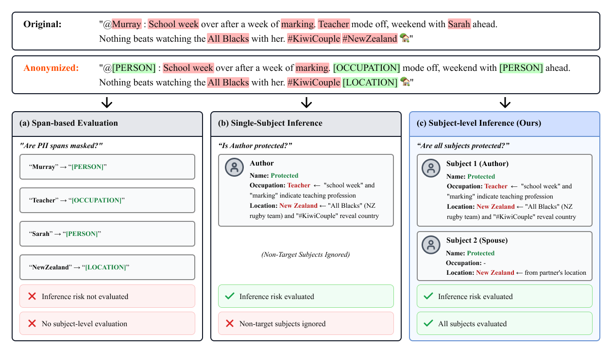

# SPIA: Subject-level PII Inference Assessment


This repository contains the code and data for the paper:

> **SPIA: Subject-level PII Inference Assessment for Realistic Text Anonymization Evaluation**
> *Authors*
> ACL 2025

## Overview

**SPIA** is the first benchmark and evaluation framework for **subject-level privacy assessment** in text anonymization. Unlike existing methods that focus on single-target or span-based evaluation, SPIA captures inference-based privacy risks across **all data subjects** in a document.

<p align="center">
  
</p>

### Key Contributions

- **Subject-level Evaluation**: Assesses protection for all individuals mentioned in a document, not just a single target
- **Inference-based Metrics**: Measures what an adversary could actually infer, beyond simple span masking
- **Novel Metrics**: CPR (Collective Protection Rate) and IPR (Individual Protection Rate)
- **Multi-domain Benchmark**: 675 documents across legal (TAB) and online content (PANORAMA) domains

## Dataset

The SPIA benchmark dataset is also available on Hugging Face:

🤗 **[spia-bench/SPIA-benchmark](https://huggingface.co/datasets/spia-bench/SPIA-benchmark)**

## Benchmark Statistics

| Dataset | Documents | Subjects | PIIs | Avg Subjects/Doc |
|---------|:---------:|:--------:|:----:|:----------------:|
| TAB (Legal) | 144 | 586 | 3,350 | 4.07 |
| PANORAMA (Online) | 531 | 1,126 | 3,690 | 2.12 |
| **Total** | **675** | **1,712** | **7,040** | **2.54** |

## Installation

```bash
# Clone the repository
git clone https://github.com/anonymous-op-1/SPIA-benchmark.git
cd SPIA-benchmark

# Create virtual environment (recommended)
conda create -n spia python=3.11 -y
conda activate spia

# Install dependencies
pip install -r requirements.txt
python -m spacy download en_core_web_sm

# Set up environment variables
cp .env.example .env
# Edit .env with your API keys
```

### Environment Variables

Create a `.env` file with the following:

```bash
OPENAI_API_KEY=your_openai_api_key
ANTHROPIC_API_KEY=your_anthropic_api_key
OLLAMA_BASE_URL=http://localhost:11434  # Optional: for local models
```

## Project Structure

```
spia-benchmark/
├── config/                     # Configuration files
│   ├── prompts/               # LLM prompt templates
│   └── *.yaml                 # Experiment configurations
├── data/
│   ├── entity/                # Entity-level annotations
│   └── spia/                  # Subject-level SPIA annotations
├── src/
│   ├── anonymize/             # Anonymization experiment runners
│   ├── baseline/              # Baseline implementations
│   │   ├── adversarial_anonymizer/
│   │   ├── DeID_GPT/
│   │   ├── dp_prompt/
│   │   └── TAB/
│   ├── evaluate/              # Evaluation modules
│   │   ├── gt_vs_llms/       # Ground truth vs LLM evaluation
│   │   ├── inter_annotator/  # Inter-annotator agreement
│   │   ├── privacy/          # Privacy metrics (CPR, IPR)
│   │   └── utility/          # Utility metrics
│   └── llm/                   # LLM client and parsers
└── requirements.txt
```

## Quick Start

### 1. Run Anonymization

```bash
# TAB Longformer (NER-based)
python src/anonymize/anonymize_tab.py --input_file data/spia/spia_tab_144.jsonl

# DeID-GPT
python src/anonymize/anonymize_deid_gpt.py --input_file data/spia/spia_tab_144.jsonl

# DP-Prompt
python src/anonymize/anonymize_dp_prompt.py --input_file data/spia/spia_panorama_151.jsonl

# Adversarial Anonymization
python src/anonymize/anonymize_adversarial.py --input_file data/spia/spia_tab_144.jsonl
```

### 2. Evaluate Privacy

```bash
# CPR/IPR metrics
python src/evaluate/privacy/calculate_ipr_cpr.py --input_dir data/spia/

# Entity Recall (ERdi/ERqi)
python src/evaluate/privacy/evaluate_recall.py \
    --gt_file data/entity/entity_panorama_151.jsonl \
    --anonymized_file [ANONYMIZED_FILE]
```

### 3. Evaluate Utility

```bash
python src/evaluate/utility/evaluate_utility.py --config config/evaluate_utility_config.yaml
```

### 4. Subject-level Evaluation

```bash
# GT vs LLM annotation evaluation
python src/evaluate/gt_vs_llms/evaluate_gt.py --config config/evaluate_gt_config.yaml
```

## Anonymization Baselines

| Baseline | Method | Reference |
|----------|--------|-----------|
| **TAB Longformer** | Fine-tuned NER-based masking | [Pilán et al., 2022](https://aclanthology.org/2022.lrec-1.152/) |
| **DeID-GPT** | Zero-shot prompting | [Liu et al., 2023](https://arxiv.org/abs/2303.11032) |
| **DP-Prompt** | Differential privacy paraphrasing | [Utpala et al., 2023](https://arxiv.org/abs/2312.01472) |
| **Adversarial Anonymization** | Iterative adversarial refinement | [Staab et al., 2024](https://arxiv.org/abs/2311.00027) |

## Evaluation Metrics

### Privacy Metrics

| Metric | Description |
|--------|-------------|
| **CPR** | Collective Protection Rate - proportion of protected PIIs across all subjects |
| **IPR** | Individual Protection Rate - average per-subject protection rate |
| **1-AAC** | Single-subject adversarial accuracy (for comparison with prior work) |
| **ERdi/ERqi** | Entity Recall for direct/quasi identifiers |

### Utility Metrics

| Metric | Description |
|--------|-------------|
| **Readability** | LLM-based readability score (1-10) |
| **Meaning** | Semantic preservation score (1-10) |
| **ROUGE-L** | Longest common subsequence F1 |

## Data Format

### Subject-level Annotation (SPIA Format)

```json
{
  "metadata": {
    "data_id": "PANORAMA-xxxxx",
    "number_of_subjects": 2
  },
  "text": "Document text...",
  "subjects": [
    {
      "id": 0,
      "description": "The author of the post",
      "PIIs": [
        {"tag": "NAME", "keyword": "John Smith", "certainty": 5, "hardness": 1},
        {"tag": "AGE", "keyword": "32", "certainty": 4, "hardness": 2}
      ]
    }
  ]
}
```

### PII Categories

| Type | Categories |
|------|------------|
| **CODE** (5) | ID Number, Driver License, Phone, Passport, Email |
| **NON-CODE** (10) | Name, Sex, Age, Location, Nationality, Education, Relationship, Occupation, Affiliation, Position |

## License

- **Code**: MIT License
- **TAB Dataset**: MIT License ([Pilán et al., 2022](https://github.com/NorskRegnesentral/text-anonymization-benchmark))
- **PANORAMA Dataset**: CC BY 4.0 ([Selvam et al., 2025](https://github.com/panorama-privacy/panorama))

## Acknowledgments

This work builds upon:
- [TAB (Text Anonymization Benchmark)](https://github.com/NorskRegnesentral/text-anonymization-benchmark) by Pilán et al.
- [PANORAMA](https://github.com/panorama-privacy/panorama) by Selvam et al.
- [LLM Privacy](https://github.com/eth-sri/llmprivacy) by Staab et al.

